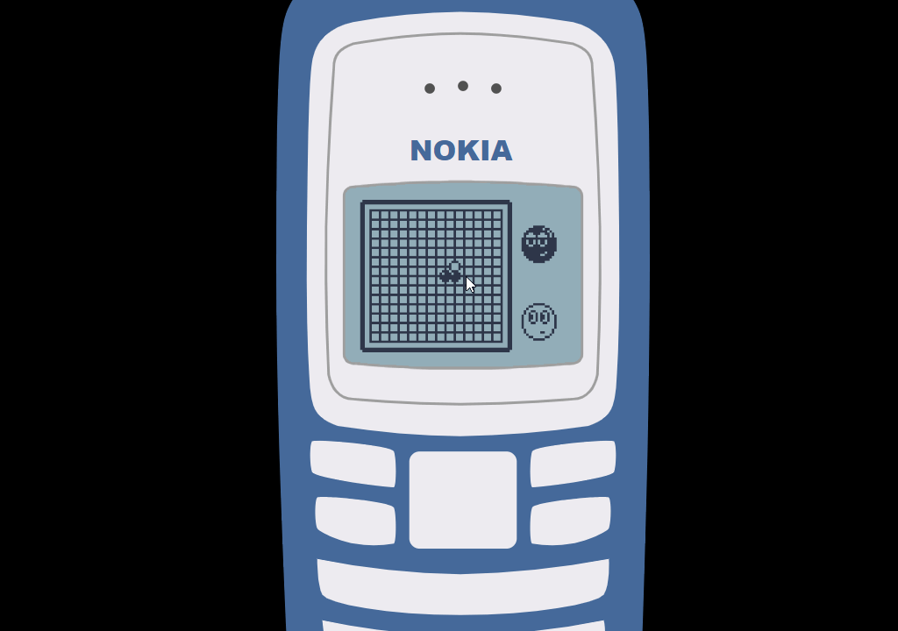

<h1 align=center>Renaissance</h1>
<h3 align=center>
  Reappearance of classic Nokia game LINK5  
</h3>

<h3 align=center><h3>

 
 

#### Background

I use [Adobe XD](https://www.adobe.com/products/xd.html) to draw the background, then generate it as `SVG` .
you can click [here](backup/renaissance-nokia2100.xd) to see my XD project.

 
 

#### AI algorithm

* [x] The Minimax Algorithm.
* [x] Alpha Beta Pruning.

 
 

